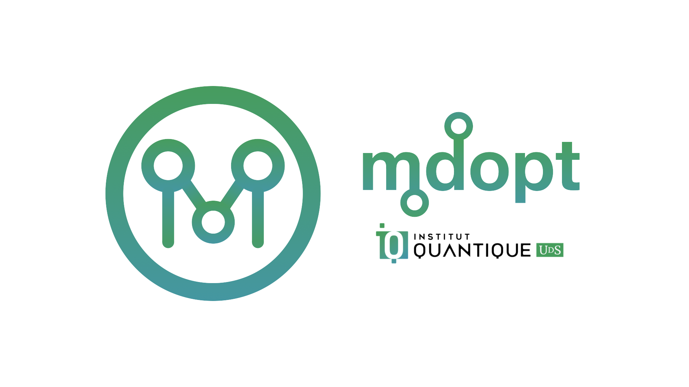

# `mdopt` — code-agnostic tensor-network (MPS-MPO) decoder for quantum error-correcting codes.

<p align="center">
  
</p>

[](https://codecov.io/gh/quicophy/mdopt)
[](https://github.com/quicophy/mdopt/actions/workflows/tests.yml)
[](https://doi.org/10.21105/joss.09125)
[](https://mdopt.readthedocs.io/en/latest/?badge=latest)
[](https://results.pre-commit.ci/latest/github/quicophy/mdopt/main)
[](https://github.com/quicophy/mdopt/actions/workflows/lint.yml)
[](https://github.com/quicophy/mdopt/actions/workflows/mypy.yml)

[](http://unitary.fund)
[](https://lbesson.mit-license.org/)


##### `mdopt` is a python package built on top of `numpy` for discrete optimisation (with the main application to classical and quantum decoding) in the tensor-network (specifically, Matrix Product States / Operators) language. The intended audience includes physicists, quantum information / error correction researchers, and those interested in exploring tensor-network methods beyond traditional applications.

## Installation

To install the current release, use the package manager [pip](https://pip.pypa.io/en/stable/).

```bash
pip install mdopt
```

Otherwise, you can clone the repository and use [poetry](https://python-poetry.org/).

```bash
poetry install
```

## Minimal example

```python
import logging

import numpy as np
import qecstruct as qec
from mdopt.decoding import decode_css

# The library does not configure logging; opt in to see progress with silent=False.
logging.basicConfig(level=logging.INFO)

# Define a small instance of the surface code
LATTICE_SIZE = 3
surface_code = qec.hypergraph_product(
    qec.repetition_code(LATTICE_SIZE),
    qec.repetition_code(LATTICE_SIZE),
)

# Input an error and choose decoder controls
logicals, success = decode_css(
    code=surface_code,
    error="IIXIIIIIIIIII",
    bias_prob=0.01,
    bias_type="Bitflip",
    chi_max=64,
    renormalise=True,
    contraction_strategy="Optimised",
    tolerance=1e-12,
    silent=False,
)
```

## Decoding circuit-level noise from a detector error model

Circuit-level noise enters through a [stim](https://github.com/quantumlib/Stim) detector error model (DEM). Every error mechanism becomes one MPS site, each detector a parity-check (XOR) constraint and each logical observable a readout, so the same MPS-MPO machinery returns the maximum-likelihood observable flip for a sampled syndrome.

```python
import stim
from mdopt.decoding import decode_dem, dem_to_problem

circuit = stim.Circuit.generated(
    "surface_code:rotated_memory_x",
    distance=3,
    rounds=3,
    after_clifford_depolarization=0.008,
    before_measure_flip_probability=0.008,
    after_reset_flip_probability=0.008,
)
# Maximum likelihood wants the undecomposed hyperedges, so keep decompose_errors off.
problem = dem_to_problem(
    circuit.detector_error_model(decompose_errors=False, flatten_loops=True)
)
sampler = circuit.compile_detector_sampler(seed=1)
detections, observables = sampler.sample(1, separate_observables=True)
class_masses, predicted_flips = decode_dem(problem, detections[0].astype(int), chi_max=32)
print(predicted_flips, observables[0].astype(int))
```

`decode_dem` returns one non-normalized weight per observable-flip class together with the most likely class; divide `class_masses` by `class_masses.sum()` to obtain probabilities. A materially negative, non-finite, or collapsed class-mass vector raises an `ArithmeticError`, but a successful contraction does not by itself certify convergence. For reliable results, decode at increasing `chi_max` values and require the normalized class weights and prediction to stabilize. The harnesses behind the decoder's validation (code-capacity thresholds of the surface code against minimum-weight perfect matching, a d=5 circuit-level cell decoded on a per-shot bond-dimension ladder with a calibration audit, and a reproduction of Fig. 1d of Piveteau, Chubb and Renes, PRX Quantum 5, 040303) live in [`examples/decoding/dem_campaign`](https://github.com/quicophy/mdopt/tree/main/examples/decoding/dem_campaign) together with a README on how every number is regenerated.

## Package layout

- `mdopt.mps` — matrix product states in the explicit (Vidal) and canonical forms.
- `mdopt.contractor` — MPS-MPO zip-up contraction with truncation.
- `mdopt.optimiser` — DMRG, dephasing DMRG, and the parity-check MPO tensors applied by `apply_constraints`.
- `mdopt.decoding` — the decoders: `decode_css`, `decode_custom` and `decode_message` for stabiliser and classical codes, `decode_dem` for detector error models.
- `mdopt.utils` — truncated SVD/QR and tensor helpers.
- `mdopt.examples` — the runnable campaign scripts behind the example notebooks.

The decoder modules used to live at `mdopt.examples.decoding.decoding` and `mdopt.examples.decoding.dem`. Those import paths still work, but emit a `DeprecationWarning` and will be removed in a future release; import from `mdopt.decoding` instead.

## Examples

The [examples](https://github.com/quicophy/mdopt/tree/main/examples) folder contains full workflows that demonstrate typical use cases, such as quantum / classical LDPC code decoding, ground state search for the quantum Ising model and random quantum circuit simulation. Each example is fully documented and serves as a starting point for building your own experiments. The shell scripts in [`examples/decoding`](https://github.com/quicophy/mdopt/tree/main/examples/decoding) run the Monte Carlo campaigns behind the notebooks, locally (`*.sh`) or as Slurm jobs (`*_cc.sh`), and the detector-error-model harnesses live in `examples/decoding/dem_campaign`.
The package has been tested on macOS and Linux (Compute Canada clusters) and does not currently support Windows.

## Cite
If you happen to find `mdopt` useful in your work, please consider supporting development by citing it.
```
@article{berezutskii2025mdopt,
  title={mdopt: A code-agnostic tensor-network decoder for quantum error-correcting codes},
  author={Berezutskii, Aleksandr},
  journal={Journal of Open Source Software},
  volume={10},
  number={115},
  pages={9125},
  year={2025}
}
```

## Contribution guidelines

If you want to contribute to `mdopt`, be sure to follow GitHub's contribution guidelines.
This project adheres to our [code of conduct](https://github.com/quicophy/mdopt/blob/main/CODE_OF_CONDUCT.md).
By participating, you are expected to uphold this code.

We use [GitHub issues](https://github.com/quicophy/mdopt/issues) for
tracking requests and bugs, please direct specific questions to the maintainers.

The `mdopt` project strives to abide by generally accepted best practices in
open-source software development, such as:

*   apply the desired changes and resolve any code
    conflicts,
*   run the tests and ensure they pass,
*   build the package from source.

Developers may find the following guidelines useful:

- **Running tests.**
  Tests are executed using [pytest](https://docs.pytest.org/):
  ```bash
  pytest tests
  ```

- **Building documentation.**
  Documentation is built with [Sphinx](https://www.sphinx-doc.org/).
  A convenience script is provided:

  ```bash
  ./generate_docs.sh
  ```

- **Coding style.**
  The project follows the [Black](https://black.readthedocs.io/en/stable/) code style.
  Please run Black before submitting a pull request:

  ```bash
  black .
  ```

- **Pre-commit hooks.**
  [Pre-commit](https://pre-commit.com/) hooks are configured to enforce consistent style automatically.
  To enable them:

  ```bash
  pre-commit install
  ```

## License

This project is licensed under the [MIT License](https://github.com/quicophy/mdopt/blob/main/LICENSE.md).

## Documentation

Full documentation is available at [mdopt.readthedocs.io](https://mdopt.readthedocs.io/en/latest/).
