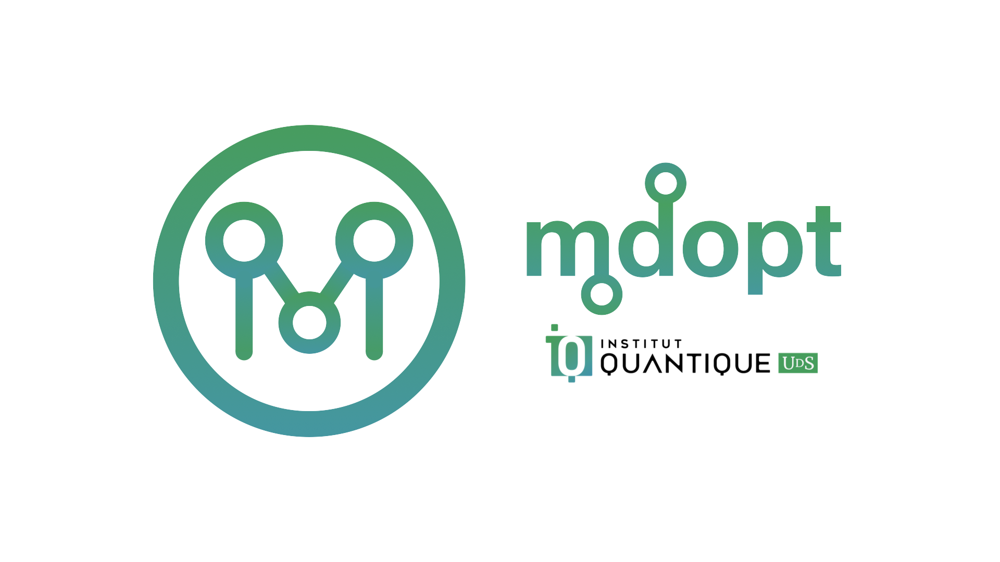

``mdopt`` — Discrete Optimisation in the MPS-MPO Language
=========================================================

|codecov| |tests| |Documentation Status| |pre-commit.ci status| |lint|
|mypy| |Unitary Fund| |MIT license|

``mdopt`` is a python package built on top of ``numpy`` for discrete optimisation (mainly for classical and quantum decoding) in the tensor-network (specifically, Matrix Product States / Operators) language. The intended audience includes physicists, quantum information / error correction researchers, and those interested in exploring tensor-network methods beyond traditional applications.
''''''''''''''''''''''''''''''''''''''''''''''''''''''''''''''''''''''''''''''''''''''''''''''''''''''''''''''''''''''''''''''''''''''''''''''''''''''''''''''''''''''''''''''''''''''''''''''''''''''''''''''''''''''''''''''''''''''''''''''''''''''''''''''''''''''''''''''''''''''''''''''''''''''''''''''''''''''''''''''''''''''''''''''''''''''''''''''''''''''''''''''''''''''''''''''''''''''''

Installation
------------

To install the current release, use the package manager
`pip <https://pip.pypa.io/en/stable/>`__.

.. code:: bash

   pip install mdopt

Otherwise, you can clone the repository and use
`poetry <https://python-poetry.org/>`__.

.. code:: bash

   poetry install

Minimal example
---------------

.. code:: python

   import numpy as np
   import qecstruct as qec
   from examples.decoding.decoding import decode_css

   # Define a small instance of the surface code
   LATTICE_SIZE = 3
   surface_code = qec.hypergraph_product(
       qec.repetition_code(LATTICE_SIZE),
       qec.repetition_code(LATTICE_SIZE),
   )

   # Input an error and choose decoder controls
   logicals, success = decode_css(
       code=surface_code,
       error="IIXIIIIIIIIII",
       bias_prob=0.01,
       bias_type="Bitflip",
       chi_max=64,
       renormalise=True,
       contraction_strategy="Optimised",
       tolerance=1e-12,
       silent=False,
   )

Examples
--------

The `examples <https://github.com/quicophy/mdopt/tree/main/examples>`__
folder contains full workflows that demonstrate typical use cases, such
as quantum / classical LDPC code decoding, ground state search for the
quantum Ising model and random quantum curcuit simulation. Each example
is fully documented and serves as a starting point for building your own
experiments. The package has been tested on macOS and Linux (Compute
Canada clusters) and does not currently support Windows.

Cite
----

If you happen to find ``mdopt`` useful in your work, please consider
supporting development by citing it.

::

   @software{mdopt2022,
     author = {Aleksandr Berezutskii},
     title = {mdopt: Discrete optimisation in the tensor-network (specifically, MPS-MPO) language.},
     url = {https://github.com/quicophy/mdopt},
     year = {2022},
   }

Contribution guidelines
-----------------------

If you want to contribute to ``mdopt``, be sure to follow GitHub’s
contribution guidelines. This project adheres to our `code of
conduct <https://github.com/quicophy/mdopt/blob/main/CODE_OF_CONDUCT.md>`__.
By participating, you are expected to uphold this code.

We use `GitHub issues <https://github.com/quicophy/mdopt/issues>`__ for
tracking requests and bugs, please direct specific questions to the
maintainers.

The ``mdopt`` project strives to abide by generally accepted best
practices in open-source software development, such as:

- apply the desired changes and resolve any code conflicts,
- run the tests and ensure they pass,
- build the package from source.

Developers may find the following guidelines useful:

- **Running tests.** Tests are executed using
  `pytest <https://docs.pytest.org/>`__:

  .. code:: bash

     pytest tests

- **Building documentation.** Documentation is built with
  `Sphinx <https://www.sphinx-doc.org/>`__. A convenience script is
  provided:

  .. code:: bash

     ./generate_docs.sh

- **Coding style.** The project follows the
  `Black <https://black.readthedocs.io/en/stable/>`__ code style. Please
  run Black before submitting a pull request:

  .. code:: bash

     black .

- **Pre-commit hooks.** `Pre-commit <https://pre-commit.com/>`__ hooks
  are configured to enforce consistent style automatically. To enable
  them:

  .. code:: bash

     pre-commit install

License
-------

This project is licensed under the `MIT
License <https://github.com/quicophy/mdopt/blob/main/LICENSE.md>`__.

Documentation
-------------

Full documentation is available at
`mdopt.readthedocs.io <https://mdopt.readthedocs.io/en/latest/>`__.

.. |codecov| image:: https://codecov.io/gh/quicophy/mdopt/branch/main/graph/badge.svg?token=4G7VWYX0S2
   :target: https://codecov.io/gh/quicophy/mdopt
.. |tests| image:: https://github.com/quicophy/mdopt/actions/workflows/tests.yml/badge.svg?branch=main
   :target: https://github.com/quicophy/mdopt/actions/workflows/tests.yml
.. |Documentation Status| image:: https://readthedocs.org/projects/mdopt/badge/?version=latest
   :target: https://mdopt.readthedocs.io/en/latest/?badge=latest
.. |pre-commit.ci status| image:: https://results.pre-commit.ci/badge/github/quicophy/mdopt/main.svg
   :target: https://results.pre-commit.ci/latest/github/quicophy/mdopt/main
.. |lint| image:: https://github.com/quicophy/mdopt/actions/workflows/lint.yml/badge.svg
   :target: https://github.com/quicophy/mdopt/actions/workflows/lint.yml
.. |mypy| image:: https://github.com/quicophy/mdopt/actions/workflows/mypy.yml/badge.svg?branch=main
   :target: https://github.com/quicophy/mdopt/actions/workflows/mypy.yml
.. |Unitary Fund| image:: https://img.shields.io/badge/Supported%20By-Unitary%20Fund-brightgreen.svg?logo=data%3Aimage%2Fpng%3Bbase64%2CiVBORw0KGgoAAAANSUhEUgAAACgAAAASCAYAAAApH5ymAAAAt0lEQVRIic2WUQ6AIAiGsXmC7n9Gr1Dzwcb%2BUAjN8b%2B0BNwXApbKRRcF1nGmN5y0Jon7WWO%2B6pgJLhtynzUHKTMNrNo4ZPPldikW10f7qYBEMoTmJ73z2NFHcJkAvbLUpVYmvwIigKeRsjdQEtagZ2%2F0DzsHG2h9iICrRwh2qObbGPIfMDPCMjHNQawpbc71bBZhsrpNYs3qqCFmO%2FgBjHTEqKm7eIdMg9p7PCvma%2Fz%2FwQAMfRHRDTlhQGoOLve1AAAAAElFTkSuQmCC
   :target: http://unitary.fund
.. |MIT license| image:: https://img.shields.io/badge/License-MIT-blue.svg
   :target: https://lbesson.mit-license.org/
