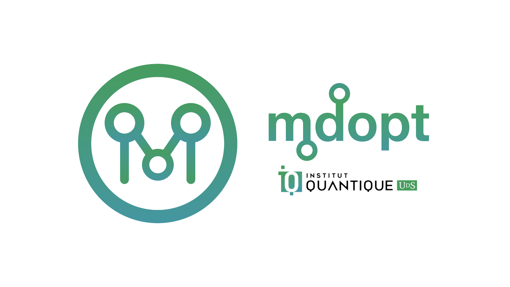

Documentation
=============

``mdopt`` is a Python package for discrete optimisation in the tensor-network
language (MPS/MPO/DMRG). It targets problems such as quantum error-correction decoding with a code-agnostic workflow and is intended to be easily extensible to other applications.

For installation and a minimal working example, see :doc:`getting_started`.
For a curated overview of notebooks, see :doc:`examples`.

.. toctree::
   :maxdepth: 2
   :caption: Getting started

   getting_started

.. toctree::
   :maxdepth: 2
   :caption: Examples

   examples

.. toctree::
   :maxdepth: 2
   :caption: Testing & validation

   testing

.. toctree::
   :maxdepth: 2
   :caption: Contributing

   contributing

.. toctree::
   :maxdepth: 2
   :caption: API reference

   api_reference
   modules

.. toctree::
   :maxdepth: 2
   :caption: Project overview & references

   project_overview
   README <README>

Indices and tables
------------------

* :ref:`genindex`
* :ref:`modindex`
* :ref:`search`
